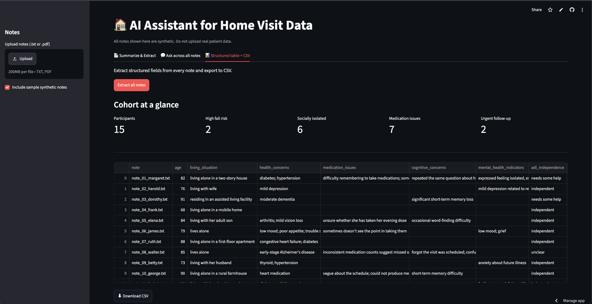
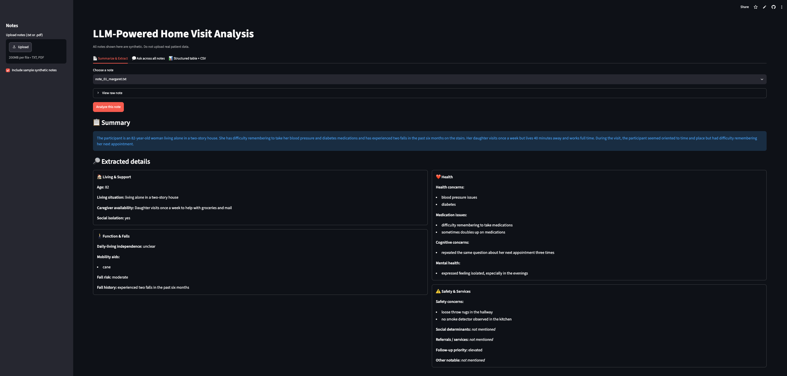

# 🏠 AI Assistant for Home Visit Data Analysis

An LLM-powered tool that helps social-work researchers analyze unstructured
home-visit notes. It **summarizes** visits, **extracts** structured data across
17 fields, lets researchers **ask questions across all notes** using
retrieval-augmented generation (RAG), and **exports** results to CSV or JSON.

**🔗 Live demo:** [home-visit-ai.streamlit.app](https://home-visit-ai.streamlit.app/)
*(password-protected — available on request)*

> ⚠️ **Ethics note:** All notes in this project are synthetic. It must **never**
> be used with real patient or participant data.



## What it does

- **Summarize & Extract** — turns a single home-visit note into a plain-language
  summary plus a structured, category-grouped profile.
- **Ask across all notes** — natural-language Q&A grounded in the notes (RAG),
  with the source excerpts shown so answers are traceable.
- **Cohort at a glance** — headline stats across all participants (fall risk,
  isolation, medication issues, urgent follow-ups) at a single click.
- **Export** — download one note's results as JSON/CSV, or the whole cohort as CSV.

## Potential research applications

- Summarizing field notes quickly after home visits
- Flagging participants who may need urgent follow-up
- Tracking changes in caregiver burden or risk over time
- Supporting large-scale analysis of qualitative social-work data that would be
  slow to code by hand

## How it works

It's a Streamlit app that sends home-visit notes to an LLM through the OpenAI API
to generate summaries and structured JSON. For open-ended questions, it uses RAG:
embeddings and a FAISS vector search retrieve the most relevant notes, and the LLM
answers based on those excerpts rather than guessing. A Pydantic schema acts as the
contract that forces clean, consistent structured output. Streamlit builds the
interface and hosts it on a public URL.

- **LLM (OpenAI API):** summarizing, extracting, and answering questions
- **Embeddings + FAISS:** the vector search that powers retrieval
- **RAG:** connects retrieval to the LLM for grounded, note-based answers
- **Pydantic schema:** enforces clean structured extraction
- **Streamlit:** the interface and hosting



## Extracted fields

The tool extracts 17 fields, grouped into four domains:

- **Living & Support:** age, living situation, caregiver availability, social isolation
- **Health:** health concerns, medication issues, cognitive concerns, mental-health indicators
- **Function & Falls:** daily-living independence, mobility aids, fall risk, fall history
- **Safety & Services:** safety concerns, social determinants, referrals/services, follow-up priority, other notable

The fields were chosen to capture the dimensions most relevant to aging and
social-work research — health status, social support, safety, and care needs.

The schema is defined in `schema.py` — adding or changing a field there updates the
entire app automatically.

## Tech stack

| Layer | Tool |
|---|---|
| LLM + embeddings | OpenAI (`gpt-4o-mini`, `text-embedding-3-small`) |
| Structured extraction | OpenAI Structured Outputs + Pydantic |
| Vector search (RAG) | FAISS |
| UI + hosting | Streamlit / Streamlit Community Cloud |
| Data | Synthetic home-visit notes |

## Project layout

home-visit-ai/
├── app.py         # Streamlit UI (3 tabs)
├── config.py      # model + client in one place
├── schema.py      # Pydantic extraction schema (the 17 fields)
├── extract.py     # summarize() and extract() — the core LLM calls
├── rag.py         # embeddings + FAISS index + answer_question()
├── requirements.txt
├── .env.example
├── data/synthetic_notes/   # 15 synthetic notes
└── docs/images/            # screenshots

## Setup

```bash
# 1. Create and activate a virtual environment
python3 -m venv .venv
source .venv/bin/activate

# 2. Install dependencies
pip3 install -r requirements.txt

# 3. Add your API key
cp .env.example .env      # then edit .env and paste your OPENAI_API_KEY
```

Running the sample notes costs only a few cents with `gpt-4o-mini`.

## Run

```bash
# Command-line test of one note:
python3 extract.py data/synthetic_notes/note_01_margaret.txt

# Full app:
streamlit run app.py
```

## Known limitations

- **Extraction vs. interpretation:** the list fields (what was said) are reliable;
  the judgment fields (fall risk, follow-up priority) are the model's interpretation
  and would need clinician validation.
- Extraction quality depends on note wording; results should always be spot-checked
  against the source note.
- Built and tuned for aging/home-visit research; a different population would need
  schema fields adapted to its variables.
- A research/portfolio prototype — not validated for clinical use.